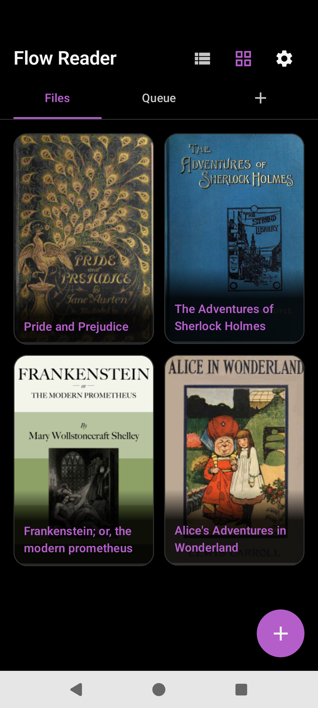

# Flow Reader

Personal Android eReader — vertical flow reading and TTS.

---

### [Overview](overview.md)

What the app is, formats, and non-goals.

### [Navigation](navigation.md)

Activities, routes, and how screens connect.

### [Library](library.md)

Files, Queue, shelves, plugins, cards, and add flows.

### [Reader](reader.md)

Chrome, gestures, TOC, pin card, margin rail, and selection.

### [Settings](settings.md)

About, Audio, Filters, Import, and Layout — every control.

### [Import and share](import-share.md)

Share ingress, router rules, overlay chooser, and page crawl.

### [Royal Road](royal-road.md)

Plugin tab, Follow lists, splash, stream, and download.

### [TTS](tts.md)

Engines, playback, highlight, and queue auto-advance.

### [Data and storage](data.md)

DataStore keys, Room tables, and on-disk layout.

---

Screenshots use public-domain books from [Project Gutenberg](https://www.gutenberg.org/) (Alice, Pride and Prejudice, Frankenstein, Sherlock Holmes).
