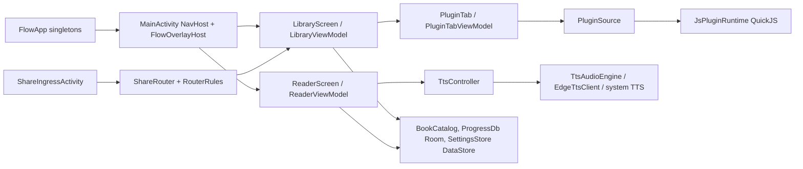

# Agent map

Start here. Find the area, open the listed files with offsets from [index.md](index.md) (generated;
every file, declaration, and line number), and read the area's history in
`../flow-reader-chats/areas/<area>.md` when it exists. Search only for what this page doesn't answer.
Paths below are relative to `app/src/main/java/com/personal/flowreader/`.

## Repos

| Repo | Role | Agent entry |
| --- | --- | --- |
| `flow-reader` (this) | Android app, plugin contract (`docs/plugins/`) | `AGENTS.md`, this file |
| `../flow-reader-plugins` | Public plugin sources, Node test host, index build, Pages publish | its `AGENTS.md` |
| `../flow-reader-chats` | Private: area history, decisions, plans, handoffs, raw transcripts | its `README.md` |

## Runtime shape



`FlowApp` owns the singletons: `db`, `settings`, `tts`, `catalog`, `pluginManager`, `pluginBooks`,
`pluginRepos`, `pluginInstaller`, `appScope`. ViewModels reach them via the application.
Routes and Back behavior: [navigation.md](../navigation.md).

## Change X, edit Y

| Change | Files | Also update |
| --- | --- | --- |
| Reader rendering, pin card | `ui/reader/ReaderScreen.kt` (large; use index offsets), `ReaderChrome.kt`, `ReaderHome.kt` | `docs/reader.md` |
| Margin rail (cache dots, hold-to-regenerate) | `ui/reader/ReaderRail.kt` | `docs/reader.md` |
| TTS highlight drawing, justify offsets, hit-test | `ui/reader/ReaderTextLayout.kt` | |
| Reader gestures / touch routing | `ui/reader/ReaderTouchPolicy.kt` (pure, tested), `ReaderTouchGestures.kt` | `ReaderTouchPolicyTest` |
| Reader load, progress, filters, ToC | `ui/reader/ReaderViewModel.kt`, `ReaderBook.kt` (local/plugin book), `ReaderSessions.kt` (window build, locator), `TocOverlay.kt` | `docs/data.md` |
| Chapter loading window, stable sentence indices | `data/ChapterSource.kt`, `EpubChapterSource.kt`, `TxtChapterSource.kt`, `ReadingSession.kt`, `SentenceTable.kt`, `LocusAnchor.kt` | `ChapterSourceTest`, `ReadingSessionTest`, `SentenceTableTest` |
| Position writes | `data/ProgressWriter.kt` | `ProgressWriterTest`, `docs/data.md` |
| TTS playback, queueing, prefetch, cache | `tts/TtsController.kt` (large) | `docs/tts.md` |
| PCM output, crossfade, gaps | `tts/TtsAudioEngine.kt`, `Crossfade.kt` | `CrossfadeTest` |
| Edge voices / synth | `tts/EdgeTtsClient.kt`, `EdgeHandshake.kt`; voice list `EdgeVoiceCatalog.kt` (pure), `EdgeVoiceStore.kt`, snapshot `resources/tts/edge_voices.json` | `EdgeTtsClientTest`, `EdgeVoiceCatalogTest` |
| Edge race stagger / network fallback (Wi-Fi ↔ cellular lanes, offline wait) | `tts/RaceSchedule.kt`, `NetworkLanePolicy.kt` (pure), `NetworkMonitor.kt`, `EdgeNetwork.kt`, `TtsController.awaitNetworkRetry` | `RaceScheduleTest`, `NetworkLanePolicyTest`, `docs/tts.md` |
| Word highlight timing | `tts/WordHighlight.kt` | `WordHighlightTest` |
| Media session / background | `tts/TtsPlaybackService.kt`, `AudioKeepAlive.kt`, `UnderlayBluetoothMonitor.kt` | |
| Sentence splitting | `data/SentenceSplitter.kt`, `KoehnSentenceBreak.kt`, `SentenceLengthNormalizer.kt` | `SentenceSplitterTest` |
| Text filters (Global/Groups/Local) | `data/TextFilters.kt`; UI `ui/settings/FiltersSettings.kt` (tab, editor), `FilterRuleList.kt` (list) on `EditableRuleList.kt` (shared hold-to-edit, reorder, delete; also Router/Parser lists); TTS-only rules reach playback via `TtsController.setSpeechFilters` | `TextFiltersTest`, `docs/settings.md` |
| Unspeakable / rejected sentences (skip, log) | `tts/SpeechText.kt` (pure), `TtsController.loop`, `EdgeContentException` in `EdgeTtsClient.kt` | `SpeechTextTest`, `docs/tts.md` |
| EPUB/TXT ingest, covers | `data/Ingest.kt`, `EpubCover.kt`, `BookCatalog.kt` | `IngestTest` |
| Library tabs, shelves, view mode | `ui/library/LibraryViewModel.kt`, `LibraryScreen.kt`, `data/Models.kt` (`LibraryTabId`) | `docs/library.md` |
| Queue | `BookCatalog` (`listQue`, `reorderQue`, `markQueDone`), `ProgressDb` (`que_items`); list UI `QueTab` in `LibraryScreen.kt` (on `EditableRuleList`) | `docs/library.md` |
| Queue stream (one document in reader + TTS) | `ui/reader/QueueBook.kt` (pure composite book, locator, `QueueChange`, `remap`, `tocItems`), `QueueStreams.kt` (build/open, `QueueStreamRef`), `QueuePlayback.kt` (live owner: `que_items` Flow → in-place append or rebuild, done marking), `ReaderQueueMode.kt` (reader side) | `QueueBookTest`, `docs/tts.md` |
| Queue Contents (live, hold-to-edit) | `ui/reader/QueueTocOverlay.kt` (on `EditableRuleList` `below`/`deleteNote`), wired in `ReaderScreen` | `docs/reader.md` |
| A setting (new key) | `data/SettingsStore.kt` (prefs + setter), `ui/settings/SettingsState.kt`, the tab file | `docs/settings.md`, `docs/data.md` |
| Layout theme (hue, saturation, lightness) | `ui/settings/ThemeSettingsPane.kt`; color math `ui/theme/Theme.kt`; `AccentLightness.scale` in `data/Models.kt` | `docs/settings.md`, `AccentLightnessTest` |
| Audio settings UI | `ui/settings/AudioSettings.kt` (tab shell), `VoiceSettingsTab.kt`, `PlaybackSettingsTab.kt` (incl. underlay), `AudioSettingsControls.kt` (flyout header, labels, center slider) | `docs/settings.md` |
| Room schema | `data/ProgressDb.kt` (add `MIGRATION_n_m`, bump version) | `docs/data.md` |
| Share routing / parse rules | `share/ShareDomainRules.kt` (`RouterRules`, `ParseRules`), `ShareRouter.kt`; UI `ui/settings/SharingSettingsTab.kt` (panes), `ImportRouterRules.kt`, `ImportParseRules.kt`, `ImportRuleControls.kt` | `ShareRouterTest`, `docs/import-share.md` |
| Web page parse (Custom fields, Next-link crawl → EPUB) | `share/WebPageIngest.kt` (`ParseSelectors`, `CssList`), `WebCrawl.kt`, `EpubWriter.kt`, `HtmlParagraphs.kt` (HTML → paragraphs, also plugin chapters); crawl prompt `ui/library/WebCrawlCards.kt` + `LibraryViewModel.startWebImport` | `WebPageIngestTest`, `WebCrawlTest`, `HtmlParagraphsTest` |
| Parser on-page picker | `ui/settings/PagePickerOverlay.kt` (WebView), `assets/picker/picker.js`, `share/SelectorBuilder.kt` (pure) | `SelectorBuilderTest`, `docs/import-share.md` |
| Plugin runtime / `flow.*` host API | `plugin/runtime/*` | Cross-repo checklist |
| Plugin models, caps, versions | `plugin/api/PluginModels.kt`, `PluginManifest.kt` | Cross-repo checklist |
| Plugin tab UI, story card, downloads, position slider | `ui/plugin/PluginTabViewModel.kt` (large), `PluginTab.kt`, `StoryMediaCard.kt`, `StoryCacheCards.kt` | `docs/plugins.md` |
| Plugin chapter cache policy (cache level ahead, cleanup, pins) | `plugin/store/PluginSessionStore.kt` (`fetchIndices`, `pruneIndices`, pure), `PluginBookStore.kt` (`maintainChapterCache`, `scheduleMaintain`) | `PluginSessionStoreTest`, `docs/plugins.md` |
| Plugin repos / install | `plugin/repo/*`, `ui/settings/PluginsSettingsTab.kt` | `RepoIndexTest` |
| Media card content | `ui/design/card/media/MediaCardAdapters.kt` (pure) | `MediaCardAdaptersTest` |
| Any UI component / token | `ui/design/**`, `ui/theme/**` | `docs/ui-system/` (rule: `ui-system.mdc`) |
| Release | `app/build.gradle.kts` (`versionCode`, `versionName`) | `../flow-reader-chats/areas/release.md` |

## Large files (read by offset, never whole)

`TtsController.kt` 2045, `ReaderScreen.kt` ~1100 (one composable), `LibraryViewModel.kt` 840,
`PluginTabViewModel.kt` 838. Member line numbers are in [index.md](index.md). Single-class files can't
be split by moving code; they need helper-class extraction (separate, tested refactors).

## Cross-repo change checklist (plugin-visible changes)

1. **Versions:** app `PLUGIN_HOST_API_VERSION` / `PLUGIN_MIN_API_VERSION` (`plugin/api/PluginManifest.kt`)
   and plugins `HOST_API_VERSION` (`../flow-reader-plugins/scripts/build-index.mjs`) move together.
   Never drop an accepted version.
2. **Host API:** any `flow.*` change in `plugin/runtime/*` is mirrored in
   `../flow-reader-plugins/test/host.mjs`.
3. **Contract:** `docs/plugins/api.md`, `ui-contract.md`, `schema/*.json`, `examples/`. Icon tokens
   (`ui/design/FlowIcons.kt`) are append-only.
4. **Tests:** app `.\gradlew.bat :app:testDebugUnitTest`; plugins `npm test`, `npm run build`, `npm run check`.
5. **Plugin release:** bump `version` in `<Plugin>/plugin.json`, rebuild `index.json`, commit. Never
   change `id` or `bookIdPrefix`.
6. **Order:** ship the app change first. Pushing plugins `main` publishes to users immediately via
   Pages, so a plugin may only rely on what released apps support (or degrade gracefully).
7. Device test: `.\gradlew.bat :app:installDebug` bundles the sibling plugins checkout.

## Verify

```powershell
.\gradlew.bat :app:compileDebugKotlin
.\gradlew.bat :app:testDebugUnitTest
.\scripts\gen-agent-index.ps1          # after adding/moving/splitting files
```
