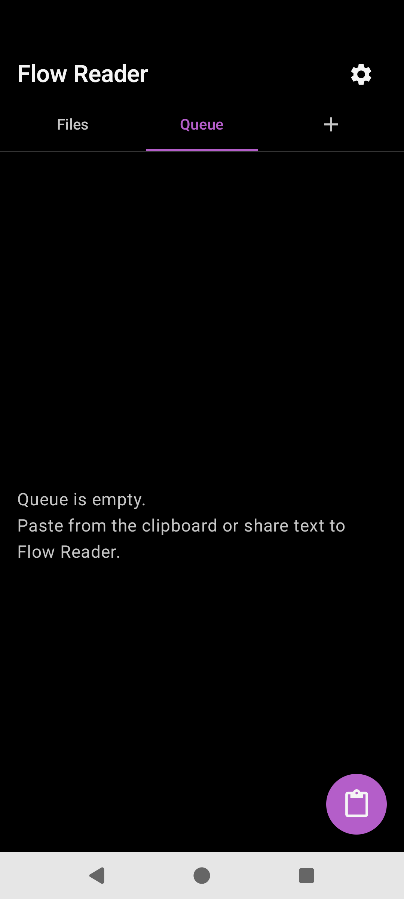

# Library

Home screen: tabs for **Files**, **Queue**, optional custom shelves and plugins, plus **+** to add a tab.

## UI map — header

| Control | Action |
|---------|--------|
| Title “Flow Reader” | Brand |
| List view / Shelf view | Toggle `library_view` (list rows vs cover grid) |
| Settings gear | Opens Settings overlay |
| Tabs: Files, Queue, …, **+** | Select tab; **+** opens “Add a tab” |

## Files

| Element | Behavior |
|---------|----------|
| Empty copy | “No books yet…” |
| Book card tap | Open `reader/{id}` |
| Long-press | Files splash: Open / Share / Remove |
| FAB **+** “Add file” | “Add a book” → Import a copy / Reference in place → system picker |
| Subtitle | Source label · relative time |
| Link badge | Linked (in-place) files |
| Progress bar | Reading progress |

**Import a copy** stores the file under app storage. **Reference in place** keeps a persistable URI when the location allows it.

## Queue

| Element | Behavior |
|---------|----------|
| Empty copy | Paste or share text into Flow Reader |
| Row tap | Open queue reader route |
| Done label | Finished while listening |
| Delete | Remove from queue |
| FAB paste | Clipboard → Import router |

Queue is for share/clipboard ingest and TTS auto-advance — not for dumping Royal Road stories.

## Add a tab

- **Custom shelf:** name field, “Add shelf”; shelves appear as Import Router destinations
- **Plugins:** e.g. Royal Road — Add / Remove to show a library tab

## Source

- [`LibraryScreen.kt`](../app/src/main/java/com/personal/flowreader/ui/library/LibraryScreen.kt)
- [`LibraryBookCards.kt`](../app/src/main/java/com/personal/flowreader/ui/library/LibraryBookCards.kt)
- [`LibraryViewModel.kt`](../app/src/main/java/com/personal/flowreader/ui/library/LibraryViewModel.kt)
- [`FilesBookSplash.kt`](../app/src/main/java/com/personal/flowreader/ui/library/FilesBookSplash.kt)

[Back to hub](README.md)
