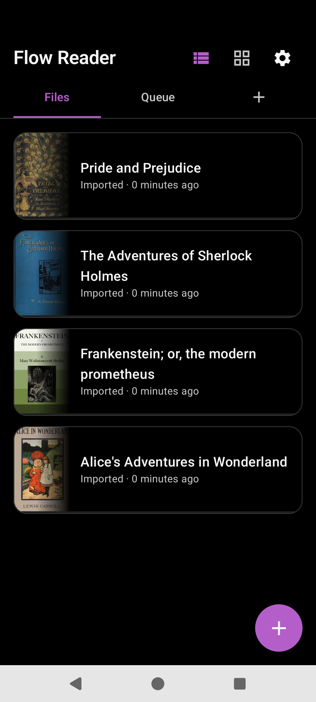
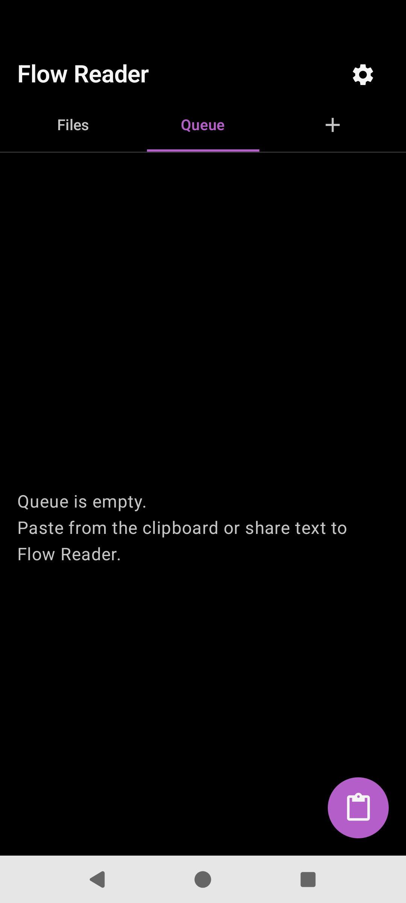
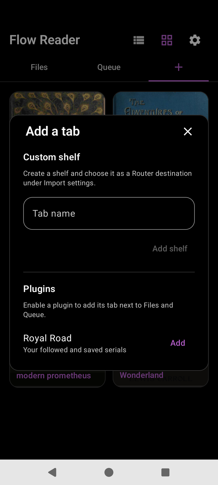

# Library

Home screen: tabs for **Files**, **Queue**, optional custom shelves and plugins, plus **+** to add a tab.

## UI map — header

| Control | Action |
|---------|--------|
| Title “Flow Reader” | Brand |
| List view / Shelf view | Toggle `library_view` (list rows vs cover grid) |
| Settings gear | Opens Settings overlay |
| Tabs: Files, Queue, …, **+** | Select tab; **+** opens “Add a tab” |

Tabs are a `Primary` `FlowTabBar`; **+** is its trailing action tab. The screen is a
`FlowScreen(Library)`: FAB per tab, snackbar above the FAB, cards stack in the window overlay.

## Now playing (bottom dock)

While a TTS session is active, a floating **Now playing** card sits in the bottom dock: title and
current sentence snippet. Playback keeps running after leaving the reader, and the card stays while
paused (`TtsUiState.sessionActive`).

| Control | Action |
|---------|--------|
| Card body | Open the reader at that book; playback continues uninterrupted at the spoken sentence |
| Play / Pause | Toggle playback without leaving the library |
| X | Stop playback (ends the session and the media notification) and close the card |

The session also ends on notification Stop, end of book, or a playback error. Plugin stories keep
playing only through chapters already loaded; streaming the next chapter needs the reader open.
Lists pad by the dock height, so the card never covers the last row.

## Files

| Element | Behavior |
|---------|----------|
| Empty copy | “No books yet…” |
| Book card tap | Open `reader/{id}` |
| Long-press | Files splash: Open / Share / Remove |
| FAB **+** “Add file” | “Add a book” → Import a copy / Reference in place → system picker |
| Subtitle | Source label · relative time |
| Link badge | Linked (in-place) files |
| Progress bar | Reading progress |

**Import a copy** stores the file under app storage. **Reference in place** keeps a persistable URI when the location allows it.

## Queue

| Element | Behavior |
|---------|----------|
| Empty copy | Paste or share text into Flow Reader |
| Row tap | Open queue reader route |
| Done label | Finished while listening |
| Delete | Remove from queue |
| FAB paste | Clipboard → Import router |

Queue is for share/clipboard ingest and TTS auto-advance — not for dumping plugin stories.

## Add a tab

- **Custom shelf:** name field, “Add shelf”; shelves appear as Import Router destinations
- **Plugins:** installed plugins (e.g. Royal Road) — Add / Remove to show a library tab; install from Settings → Import → Plugins ([plugins.md](plugins.md))

## Source

- [`LibraryScreen.kt`](../app/src/main/java/com/personal/flowreader/ui/library/LibraryScreen.kt)
- [`LibraryBookCards.kt`](../app/src/main/java/com/personal/flowreader/ui/library/LibraryBookCards.kt)
- [`LibraryViewModel.kt`](../app/src/main/java/com/personal/flowreader/ui/library/LibraryViewModel.kt)
- [`FilesBookSplash.kt`](../app/src/main/java/com/personal/flowreader/ui/library/FilesBookSplash.kt) (`FlowMediaCard` + `FileMediaCardAdapter`)
- [`NowPlayingCard.kt`](../app/src/main/java/com/personal/flowreader/ui/library/NowPlayingCard.kt)
- UI components: [UI system](ui-system/README.md)

[Back to hub](README.md)
