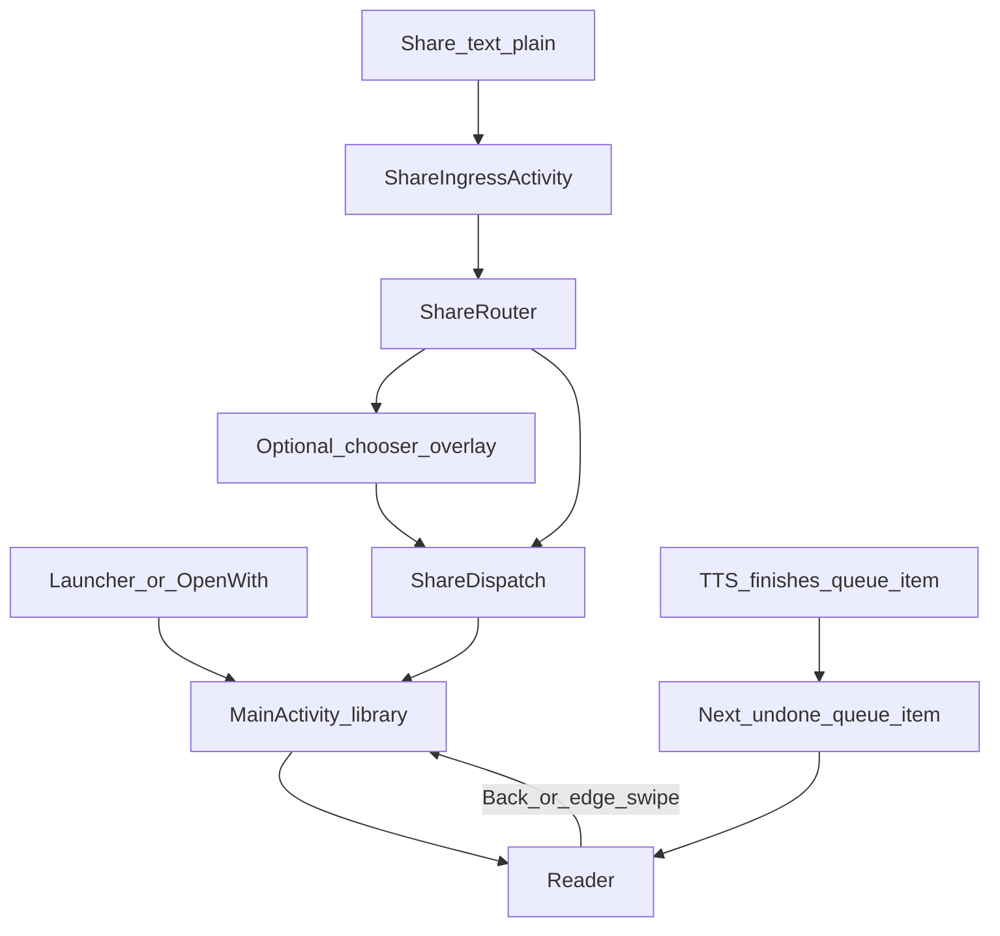

# Navigation

## Destinations

| Route | Screen |
|-------|--------|
| `library` (start) | Library |
| `reader/{bookId}` | Reader for a library book |
| `reader/{bookId}/que/{queId}?autoPlay=` | Reader for a queue item (optional auto-play) |

Entry: [`MainActivity.kt`](../app/src/main/java/com/personal/flowreader/MainActivity.kt).

## Separate activity

| Activity | Role |
|----------|------|
| [`ShareIngressActivity`](../app/src/main/java/com/personal/flowreader/share/ShareIngressActivity.kt) | Translucent share target; runs Import → Router before MainActivity |
| Share alias “Flow Reader” | `SEND` `text/plain` → ShareIngress |
| Legacy “Flow-Queue” alias | Disabled at runtime |

## Flow

## Incoming intents

- `VIEW` / `SEND` EPUB → import or link into Files (or Queue if router landing says so), then open reader
- `SEND` text → ShareIngress → router outcomes (Files, Queue, Crawl, Royal Road, or chooser)
- Open-with EPUB/TXT and library picker add book via SAF

## Orientation

Layout → Orientation (`Auto` / `Portrait` / `Landscape`) is applied in MainActivity.

[Back to hub](README.md)
