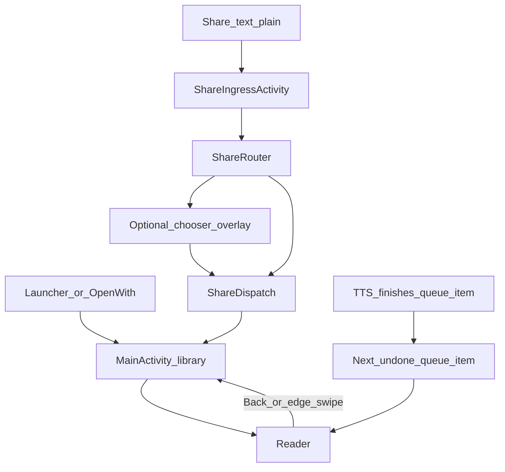

# Navigation

## Destinations

| Route | Screen |
|-------|--------|
| `library` (start) | Library |
| `reader/{bookId}` | Reader for a library book |
| `reader/{bookId}/que/{queId}` | Reader for a queue item (follows Queue auto-advance) |

Entry: [`MainActivity.kt`](../app/src/main/java/com/personal/flowreader/MainActivity.kt).

## Separate activity

| Activity | Role |
|----------|------|
| [`ShareIngressActivity`](../app/src/main/java/com/personal/flowreader/share/ShareIngressActivity.kt) | Translucent share target; runs Import → Router before MainActivity |
| Share alias “Flow Reader” | `SEND` `text/plain` → ShareIngress |
| Legacy “Flow-Queue” alias | Disabled at runtime |

## Flow

```mermaid
flowchart TD
  launcher[Launcher_or_OpenWith] --> main[MainActivity_library]
  share[Share_text_plain] --> ingress[ShareIngressActivity]
  ingress --> router[ShareRouter]
  router --> overlay[Optional_chooser_overlay]
  router --> dispatch[ShareDispatch]
  overlay --> dispatch
  dispatch --> main
  main --> reader[Reader]
  reader -->|Back_or_edge_swipe| main
  queueFinish[TTS_finishes_queue_item] --> nextQue[Next_undone_queue_item]
  nextQue --> reader
```

## Overlays and Back

`MainActivity` wraps the `NavHost` in one `FlowOverlayHost`. Every fullscreen card (Settings,
ToC, editors, plugin sheets, media cards, confirmations) registers with it while visible and
stacks in open order; the top card gets the scrim. See [UI system: layers](ui-system/layers.md).

| State | Back |
|-------|------|
| Fullscreen card(s) open | Closes the top card only (Settings → filter editor → Back returns to Settings) |
| Card with `dismissible = false` (e.g. signing in) | Ignored |
| Reader, no cards | Library |
| Library, no cards | Exit |

`ShareIngressActivity` (fallback chooser) and the share overlay window host their own overlay
stack, so the chooser is the same Compact card in both.

## Incoming intents

- `VIEW` / `SEND` EPUB → import or link into Files (or Queue if router landing says so), then open reader
- `SEND` text → ShareIngress → router outcomes (Files, Queue, Crawl, Plugin, or chooser)
- Open-with EPUB/TXT and library picker add book via SAF

## Orientation

Layout → Orientation (`Auto` / `Portrait` / `Landscape`) is applied in MainActivity.

[Back to hub](README.md)
