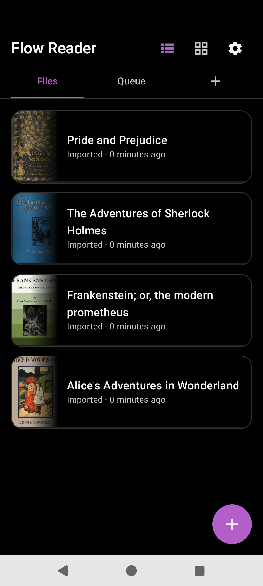

# Overview

Flow Reader is a personal Android eReader (Kotlin + Jetpack Compose). Open an EPUB or TXT, read in a vertical scroll “flow,” and listen with Edge or system TTS.

## What works

| Area | Summary |
|------|---------|
| Library | Files tab (list or shelf), import a copy or reference in place, Queue for share/clipboard text |
| Reader | Reflow text, theme / accent / font / spacing, floating chrome cards, pin when TTS scrolls away |
| TTS | Edge Neural or system engines, word/sentence highlight, media notification |
| Filters | Global / Groups / Local text replace for visible text and TTS |
| Import | Router + Parser rules for shared text/URLs; plugins may own domains |
| Royal Road | Optional plugin tab for followed/saved serials |

## Formats

- **Today:** EPUB, TXT (reflow). Shared URLs can be crawled to text when a parse rule matches.
- **Later:** PDF needs a page viewer, not this reflow path.

## Non-goals

- All-files storage access (uses the system picker / SAF)
- Forking Readest (kept only as a protocol reference elsewhere)

## Source

- [`MainActivity.kt`](../app/src/main/java/com/personal/flowreader/MainActivity.kt)
- [`FlowApp.kt`](../app/src/main/java/com/personal/flowreader/FlowApp.kt)
- [`README.md`](../README.md)

[Back to hub](README.md)
