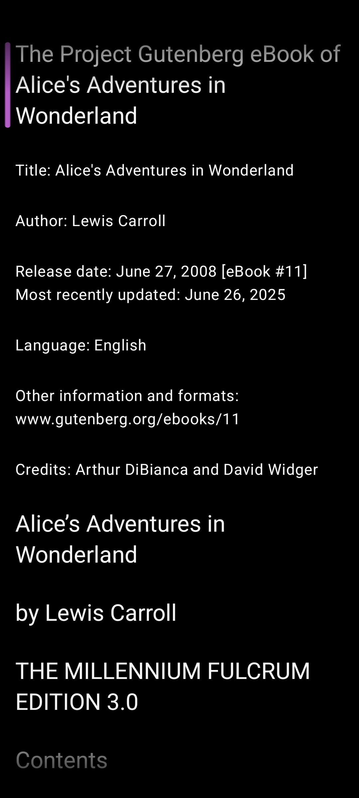
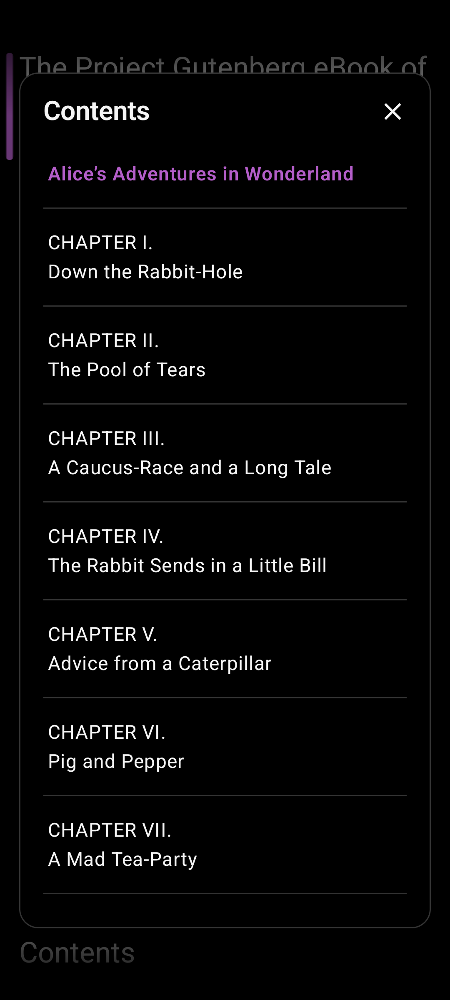

# Reader

Vertical reflow reading with immersive body text and floating chrome cards (no auto-dismiss timeout).

## Purpose

Show book text as a continuous vertical flow. Tap to reveal title + media cards; TTS follows with highlights and an optional scroll lock.

## UI map

### Body

- `LazyColumn` of paragraphs, headings, quotes
- Left **margin rail:** accent bar for current sentence; cache dots for Edge prefetched clips; loading pulse while synthesizing
- Word + sentence highlight while playing
- Edge fade at top/bottom

### Title banner (top card)

| Control | Action |
|---------|--------|
| Back | Pop to library |
| Title / chapter | Context |
| Progress bar | Reading progress |
| Settings | Same Settings overlay as library (includes Local filters) |

### Media card (bottom)

| Control | Action |
|---------|--------|
| Contents | TOC overlay |
| Prev / Next sentence | Seek TTS locus |
| Play / Pause | Start or pause TTS |
| Lock scroll to TTS | Hide chrome and force follow; unlock with **double-tap** on the lock-open control |

### Pin / jump

- While playing and spoken block is off-screen: **playback pin** with snippet — tap/double-tap resumes follow
- While paused and saved locus off-screen: **Jump back to saved position**

Free scrolling does **not** update the saved reading position; double-tap play / TTS seek does.

## Gestures

| Gesture | Result |
|---------|--------|
| Single tap body / gap / edge band | Toggle chrome (or clear selection / dismiss overlay) |
| Double tap body | Start TTS at sentence (if “Double-tap starts playback”); disabled while selecting |
| Swipe left from right edge (~24dp) | Back to library |
| Double-tap unlock | Exit scroll lock |

## TOC

Modal “Contents”; tap a chapter to seek and center.

## Text selection

System ActionMode: Copy, Share, Web search, Select all. Double-tap while selecting clears selection.

## Related settings

Layout (theme, font, spacing, screen awake), Audio (all Voice + Playback), Filters including **Local**.

## Source

- [`ReaderScreen.kt`](../app/src/main/java/com/personal/flowreader/ui/reader/ReaderScreen.kt)
- [`ReaderChrome.kt`](../app/src/main/java/com/personal/flowreader/ui/reader/ReaderChrome.kt)
- [`ReaderTouchPolicy.kt`](../app/src/main/java/com/personal/flowreader/ui/reader/ReaderTouchPolicy.kt)
- [`TocOverlay.kt`](../app/src/main/java/com/personal/flowreader/ui/reader/TocOverlay.kt)
- [`ReaderTextToolbar.kt`](../app/src/main/java/com/personal/flowreader/ui/reader/ReaderTextToolbar.kt)

[Back to hub](README.md)
