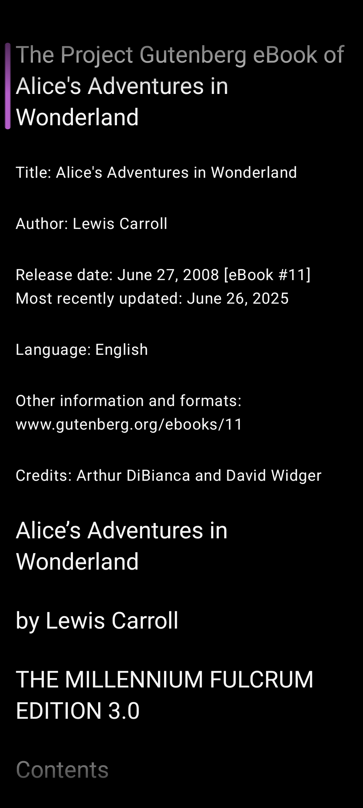
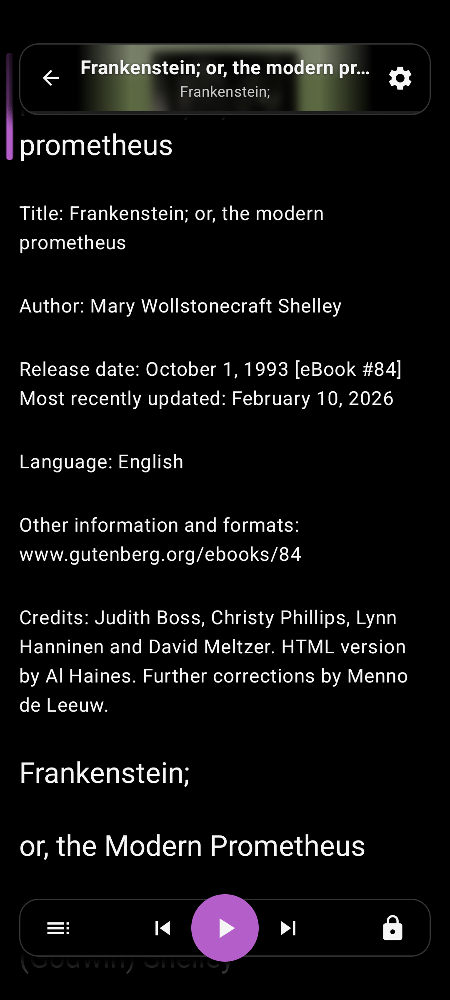
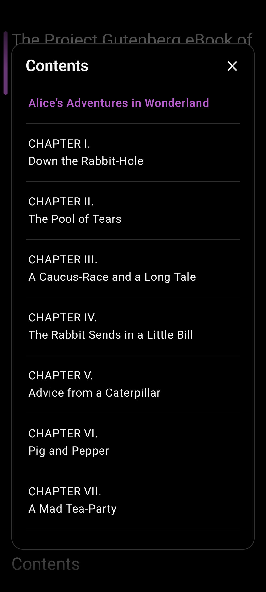

# Reader

Vertical reflow reading with immersive body text and floating chrome cards (no auto-dismiss timeout).

## Purpose

Show book text as a continuous vertical flow. Tap to reveal title + media cards; TTS follows with highlights and an optional scroll lock.

## UI map

### Body

- `LazyColumn` of paragraphs, headings, quotes
- Left **margin rail:** accent bar for current sentence; cache dots for Edge prefetched clips; loading pulse while synthesizing
- Word + sentence highlight while playing
- Edge fade at top/bottom

### Title banner (top card)

| Control | Action |
|---------|--------|
| Back | Pop to library |
| Title / chapter | Context |
| Progress bar | Reading progress |
| Settings | Same Settings overlay as library (includes Local filters) |

### Media card (bottom)

| Control | Action |
|---------|--------|
| Contents | TOC overlay |
| Prev / Next sentence | Seek TTS locus |
| Play / Pause | Start or pause TTS |
| Lock scroll to TTS | Hide chrome, force follow, disable text selection; locked controls (play/pause centered, unlock on the lock button's spot) each need a **double-tap** |

Long-press the title banner to open the book's media card (same card as the library long-press:
Files card for local books, story card for plugin books). Open/Read and Remove/Delete are hidden
because the book is already open.

### Docks

Chrome lives in two floating docks (`FlowDock`), items stacked edge-inward with a fixed gap:

| Dock | Items (top to bottom) |
|------|------------------------|
| Top | Title banner (chrome open) · pin / jump chip (when the target is above) |
| Bottom | Pin / jump chip (when the target is below) · Media card (chrome open) · Scroll-lock play/pause + unlock (locked) |

Settings, Contents and their child editors are fullscreen cards that stack; Back closes the top one.

### Current position and home

The **current position** is always a sentence, never a paragraph: the spoken sentence while TTS
plays, otherwise the saved locus sentence. The **home position** is a horizontal line in the
viewport (Settings → Layout → Reading, 15–85% from the top, default 50%). Every jump settles the current
sentence's center on that line: TTS follow, pin tap, jump-back chip, double-tap, scroll lock, ToC,
and opening the book. A sentence taller than the screen starts at the top instead.

With **Show home marker** on, the reader draws a solid bar across the text column at home; its
thickness follows the text size. Drag the bar anywhere along its length to move home (a "Home N%"
label shows while dragging); on release, if the current sentence is on-screen it settles onto the
new line.

Math lives in [`ReaderHome.kt`](../app/src/main/java/com/personal/flowreader/ui/reader/ReaderHome.kt)
(unit-tested); the rail reports the current sentence's line bounds (`SentenceSpan`).

### Pin / jump

- While playing and the spoken **sentence** is off-screen: **playback pin** with snippet — tap/double-tap resumes follow
- While paused and the saved **sentence** is off-screen: **Jump back to saved position**
- A paragraph that is still visible does not hide the chip if its current sentence has scrolled past
- Both dock at the edge nearest the off-screen sentence and return it to home

Free scrolling does **not** update the saved reading position; double-tap play / TTS seek does.
Leaving the reader does not pause TTS; the Library now-playing card controls it.

### Loading

Opening a book reads only the saved chapter, plus following chapters while it has no text (covers,
title pages). The neighbouring chapters load right after first paint. Scrolling or playback into
the first or last loaded chapter loads the next one; chapters far from both the viewport and the
TTS playhead are dropped (see [data.md](data.md#book-loading)). A ToC jump to a chapter outside the
window opens a new window there. The progress bar is whole-book progress by chapter size.

## Gestures

| Gesture | Result |
|---------|--------|
| Single tap body / gap / edge band | Toggle chrome (or clear selection / dismiss overlay) |
| Double tap body | Seek to the sentence, settle it at home, start TTS (if “Double-tap starts playback”); never toggles chrome; disabled while selecting |
| Double tap the sentence being spoken | Settle it at home and resume follow; playback continues (no restart) |
| Swipe left from right edge (~24dp) | Back to library |
| Long-press title banner | Book media card |
| Double-tap unlock / play-pause (scroll lock) | Exit scroll lock / toggle playback |

## TOC

Modal “Contents”; tap a chapter to seek and settle its first sentence at home. EPUB rows come from
the nav document (or NCX); spine entries without a ToC label are not listed.

Queue stream: one row per Queue item, with that item's chapters indented beneath when it has more
than one. Each item's title heads its text in the body (always, regardless of "Chapter headings in
body"); the header shows the current item's title, cover and "Queue · n of N".

The Queue's Contents follows the Queue table live (shares, Library edits, Done marks) without
leaving the reader, and re-reads the table each time it opens (catches changes made while TTS
wasn't on the Queue). A share that opens the Queue replaces an open Queue reader at the new entry. It has the Library Queue's edit mode: hold an item to reorder (drag handle),
select and delete (items only while editing; chapters return on Done). Items appended at the end
and Done changes apply in place, so playback isn't interrupted and TTS continues into new items.
Reordering or removing items rebuilds the stream at the same text; if TTS is playing it restarts
the current sentence once. Deleting the item being read asks first, then moves to the start of the
next item (the previous one if it was last) and keeps playing.

## Text selection

System ActionMode: Copy, Share, Web search, Filter. **Filter** opens a new **Local** filter with the
selection as the find pattern. Double-tap while selecting clears selection. Selection is off while
scroll-locked.

## Related settings

Layout (theme, font, spacing, screen awake), Audio (all Voice + Playback), Filters including **Local**.

## Source

- [`ReaderScreen.kt`](../app/src/main/java/com/personal/flowreader/ui/reader/ReaderScreen.kt)
- [`ReaderChrome.kt`](../app/src/main/java/com/personal/flowreader/ui/reader/ReaderChrome.kt)
- [`ReaderHome.kt`](../app/src/main/java/com/personal/flowreader/ui/reader/ReaderHome.kt), [`HomeMarker.kt`](../app/src/main/java/com/personal/flowreader/ui/reader/HomeMarker.kt)
- [`ReaderTouchPolicy.kt`](../app/src/main/java/com/personal/flowreader/ui/reader/ReaderTouchPolicy.kt)
- [`TocOverlay.kt`](../app/src/main/java/com/personal/flowreader/ui/reader/TocOverlay.kt), Queue: [`QueueTocOverlay.kt`](../app/src/main/java/com/personal/flowreader/ui/reader/QueueTocOverlay.kt)
- [`ReaderTextToolbar.kt`](../app/src/main/java/com/personal/flowreader/ui/reader/ReaderTextToolbar.kt)

[Back to hub](README.md)
