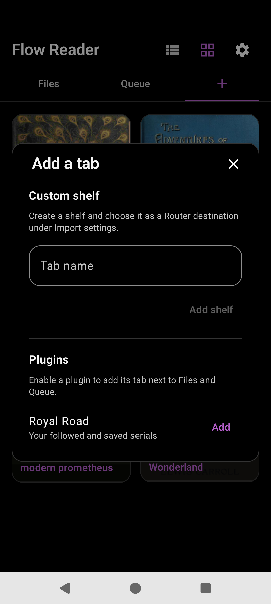

# Royal Road

Optional library **plugin** for followed and saved serials — not a browser-search home. Enable from Library → **+** → Plugins → Royal Road **Add**.

## Purpose

Keep Royal Road stories in their own tab. Queue stays for share/clipboard; do not dump RR titles into Queue.

## Tab chrome

When enabled, a **Royal Road** tab appears beside Files / Queue. Sub-areas typically include Follow / Favorite / Read Later and Account.

## Story splash

Tap opens the story; long-press opens a full splash (cover, bookmark chips, Share, Download / Refresh / Delete, **Read**).

## Stream vs download

- **Stream (default):** full ToC on follow; chapter bodies on demand; small cache around the current position
- **Download:** manual All or Partial (start chapter, optional cache settings)

## Account

Sign in (cookies only; password not stored), Sync follows (Merge / Overwrite), Sign out.

## Import routing

Default router rules send `royalroad.com` / `royalroadl.com` to **Plugin · Royal Road** (see [import-share.md](import-share.md)).

## Source

- [`library/plugin/royalroad/`](../app/src/main/java/com/personal/flowreader/library/plugin/royalroad/)
- [`RoyalRoadOverlays.kt`](../app/src/main/java/com/personal/flowreader/library/plugin/royalroad/RoyalRoadOverlays.kt)
- [`RoyalRoadStorySplash.kt`](../app/src/main/java/com/personal/flowreader/library/plugin/royalroad/RoyalRoadStorySplash.kt)
- [`RoyalRoadDownloadOverlay.kt`](../app/src/main/java/com/personal/flowreader/library/plugin/royalroad/RoyalRoadDownloadOverlay.kt)

On-disk: `filesDir/plugins/royalroad/` (session, membership, chapter cache).

[Back to hub](README.md)
