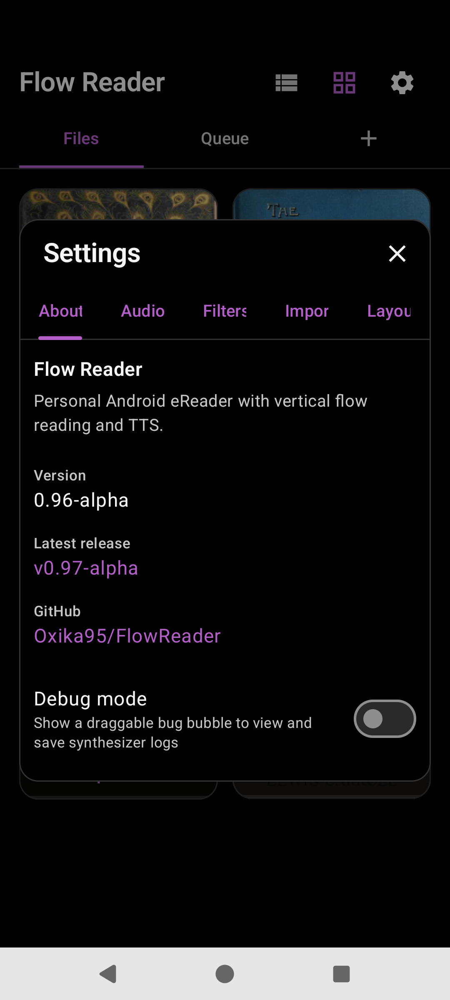
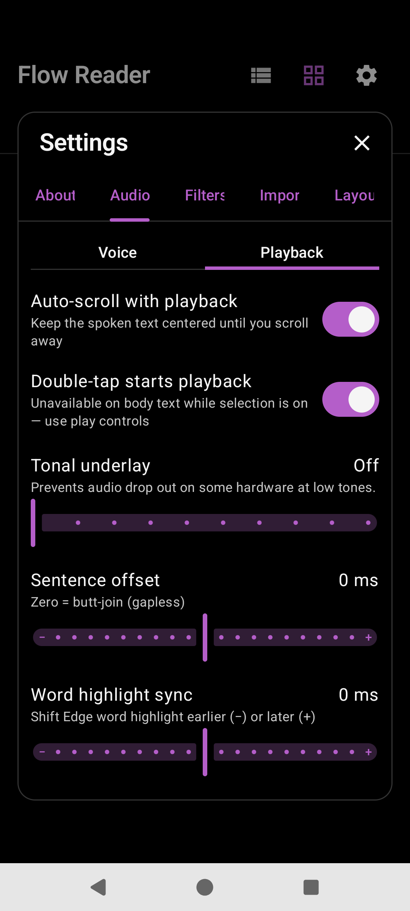
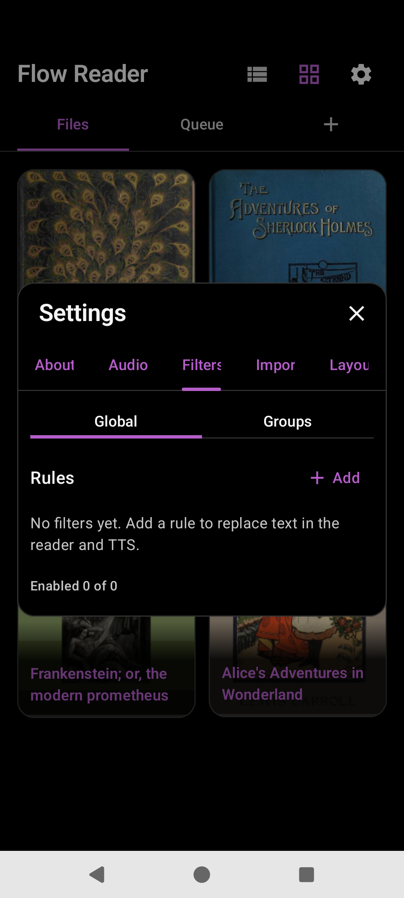
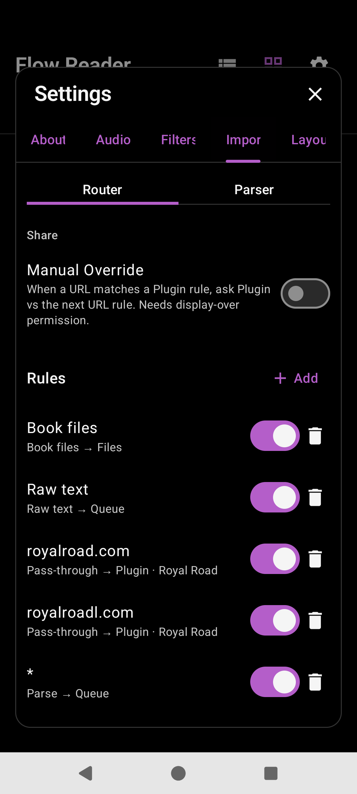
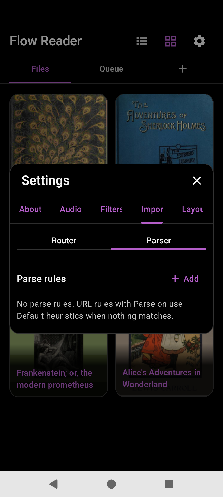
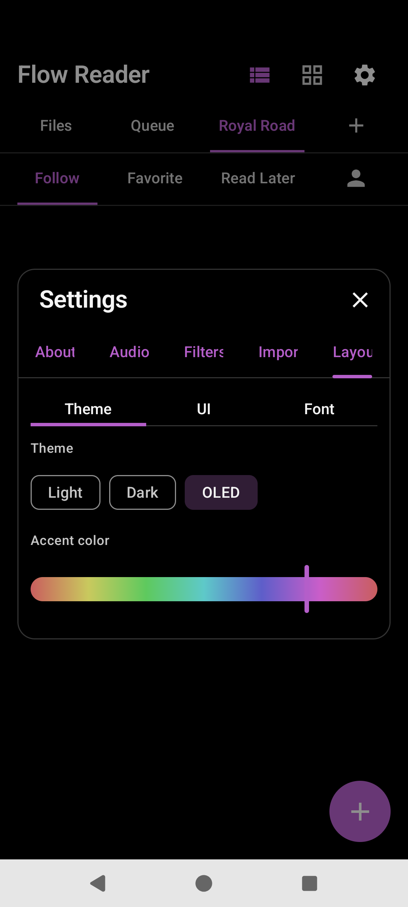
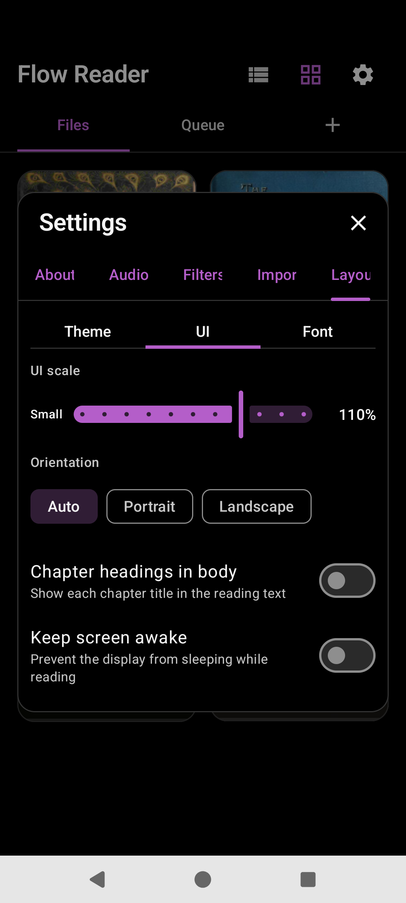
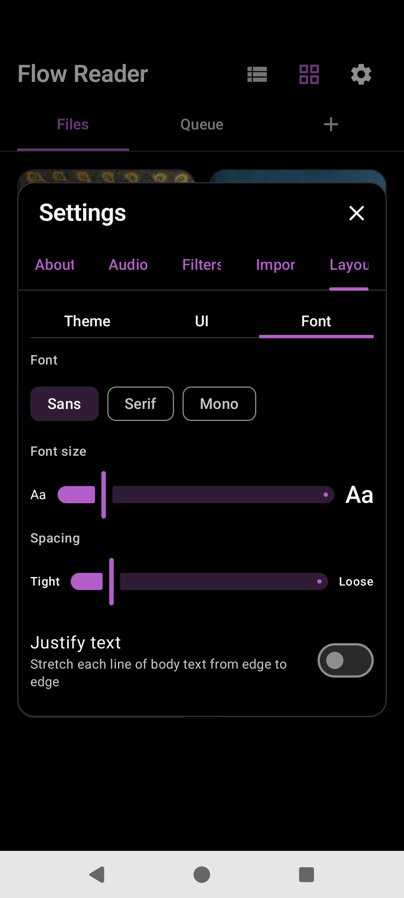

# Settings

Shared overlay from library or reader. Primary tabs (alphabetical): **About | Audio | Filters | Import | Layout**.

## About

| Control | Pref / notes |
|---------|----------------|
| Tagline | “Personal Android eReader with vertical flow reading and TTS.” |
| Version | Package `versionName` |
| Latest release | Link via GitHub API |
| GitHub | Oxika95/FlowReader |
| Debug mode | `debug_enabled` — synth dump FAB |

## Audio

Sub-tabs: **Voice | Playback**.

### Voice

| Control | Key |
|---------|-----|
| TTS Engine | `tts_engine` (Edge TTS, System Default, installed engines) |
| Language (Edge only; filters the Voice list; starts on the current voice's language, English by default) | not stored |
| Voice | `tts_voice` (default `en-US-AndrewNeural`) |
| Speed 0.5–2.5× | `tts_speed` |
| Pitch 0.5–2 | `tts_pitch` |
| Advanced ▾ Pre-cache clips 1–10 | `tts_prefetch` |
| Clip size (chars) | `tts_clip_target_chars` |
| Size leeway ± | `tts_clip_flex_chars` |

### Playback

| Control | Key |
|---------|-----|
| Auto-scroll with playback | `tts_auto_scroll` |
| Double-tap starts playback | `tts_double_tap_play` |
| Use mobile data when Wi-Fi is weak | `tts_mobile_data_fallback` — default On; Edge overlap / cellular-first lanes ([tts.md](tts.md#edge-requests-and-networks)) |
| Tonal underlay | `tts_tonal_underlay` — float level (dB), snapped to `TtsPrefs.TONAL_UNDERLAY_STEPS` |
| Underlay Bluetooth device | `tts_underlay_bt_address` / `tts_underlay_bt_name` — standby until A2DP/Headset connected |
| Sentence offset (−500…+500 ms) | `tts_sentence_gap_ms` |
| Word highlight sync | `tts_highlight_sync_ms` |

## Filters

Library Settings: **Global | Groups**. Reader Settings also **Local** (per book).

Rules apply to **visible text and TTS**, not raw HTML. Editor fields: Title, Type (case / regex), Whole words, TTS only, Find, Replace, Preview, Cancel / Save.

- Rules run top to bottom (Global, then Groups, then Local). **Whole words** adds a word boundary
  only on pattern edges that are letters/digits, so `Mr.` or `* * *` still match.
- **TTS only** rules change spoken text, never the page, and apply per sentence (a pattern can't
  span two sentences). Changes from Library or Reader settings reach playback immediately; Edge
  clip names include a hash of the TTS-only rules, so audio made with older rules is never replayed.
- **Hold** a rule to enter edit mode: drag handles reorder (saved on drop), checkboxes select,
  **All/None** toggles the selection, **Delete** asks for confirmation, **Done** or Back exits.

Storage: `global_filters` / `group_filters` JSON; Local → Room `book_filters`.

## Import

Sub-tabs: **Router | Parser | Plugins**.

### Router

| Control | Key / notes |
|---------|-------------|
| Manual Override | `share_ask_mode` — Ask vs Auto; Ask needs display-over permission |
| Rules list | Enable switch; hold for edit mode (drag reorder, multi-select, Delete) like Filters → `share_router_rules` |
| Rule editor | Content (Book files / Raw text / URL), URL match, Parse page, Destination (Files / Queue / shelves / Plugin) |

Default idea: EPUB → Files; raw text / most URLs → Queue; plugin domains → plugin.

### Parser

Parse rules (`share_parse_rules`): URL match, Default/Custom parser, Content/Title/Remove CSS, Test URL.
Hold a rule for edit mode (drag reorder, multi-select, Delete) like Filters. The **Default** rule
(any URL) is always last and protected: no delete, switch, or drag; tap edits its parser mode / CSS.

### Plugins

Installed plugins (Update, Settings, Uninstall), **New stories** defaults (Cache level: chapters
downloaded ahead of the reading position, default 1; Clean up old chapters, default off; each story
can change its own from the hold-Download card), available plugins from repositories (Install), and
the repository list (Add repository, Refresh, Remove). See [plugins.md](plugins.md).

## Layout

Sub-tabs: **Theme | UI | Font**.

| Area | Controls | Keys |
|------|----------|------|
| Theme | Light / Dark / OLED; Accent hue; Saturation (0–200% of the theme's accent saturation, default 100%) | `theme`, `accent_hue`, `accent_saturation` |
| UI | UI scale; Orientation; Chapter headings; Keep screen awake; Home position (15–85%, default 50%); Show home marker | `ui_scale`, `orientation`, `show_chapter_headings`, `keep_screen_awake`, `home_position`, `show_home_marker` |
| Font | Sans/Serif/Mono; size; spacing; Justify | `font_family`, `font_scale`, `line_spacing`, `justify_text` |

## Source

- [`SettingsOverlay.kt`](../app/src/main/java/com/personal/flowreader/ui/settings/SettingsOverlay.kt)
- [`AboutSettingsTab.kt`](../app/src/main/java/com/personal/flowreader/ui/settings/AboutSettingsTab.kt)
- [`AudioSettings.kt`](../app/src/main/java/com/personal/flowreader/ui/settings/AudioSettings.kt)
- [`FiltersSettings.kt`](../app/src/main/java/com/personal/flowreader/ui/settings/FiltersSettings.kt), [`FilterRuleList.kt`](../app/src/main/java/com/personal/flowreader/ui/settings/FilterRuleList.kt) (edit mode)
- [`SharingSettingsTab.kt`](../app/src/main/java/com/personal/flowreader/ui/settings/SharingSettingsTab.kt)
- [`AppearanceSettings.kt`](../app/src/main/java/com/personal/flowreader/ui/settings/AppearanceSettings.kt)
- [`SettingsStore.kt`](../app/src/main/java/com/personal/flowreader/data/SettingsStore.kt)

[Back to hub](README.md)
