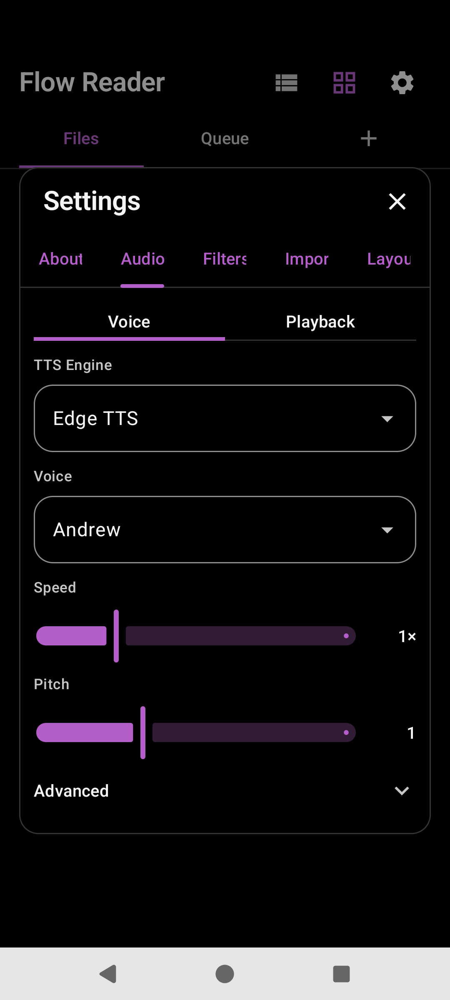
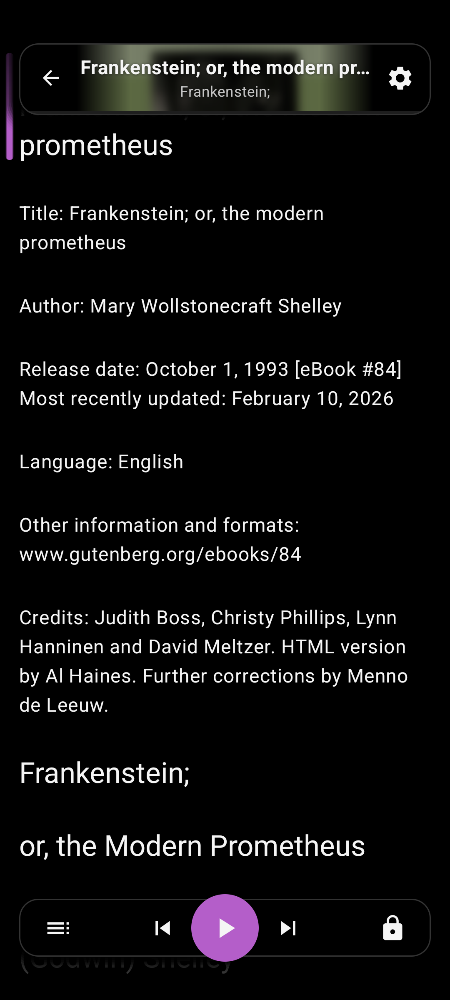

# TTS

Listen while reading. Engines and voices live under Settings → **Audio**; the reader media card and gestures control playback.

## Engines

- **Edge TTS** — Neural voices (default `en-US-AndrewNeural`), clip prefetch and size controls
- **System Default** / other installed engines — Android TTS

Priority goals: stability → latency → footprint.

## Playback behavior

| Feature | Notes |
|---------|--------|
| Sentence highlight | Always |
| Word highlight | When engine provides boundaries |
| Auto-scroll | Follows playhead when enabled |
| Scroll lock | Forces follow; double-tap to unlock |
| Pin card | When playhead leaves the viewport |
| Margin rail | Cache / loading indicators for Edge clips |
| Media session | Notification + background keep-alive via `TtsPlaybackService` |

## Queue auto-advance

When listening to a queue item, finishing the book marks it done and opens the next unfinished item (`autoPlay=1`).

## Debug

About → Debug mode shows a synth dump FAB for Edge logs.

## Source

- [`tts/`](../app/src/main/java/com/personal/flowreader/tts/)
- [`TtsPlaybackService.kt`](../app/src/main/java/com/personal/flowreader/tts/TtsPlaybackService.kt)
- [`EdgeTtsClient.kt`](../app/src/main/java/com/personal/flowreader/tts/EdgeTtsClient.kt)
- [`AudioSettings.kt`](../app/src/main/java/com/personal/flowreader/ui/settings/AudioSettings.kt)

[Back to hub](README.md)
