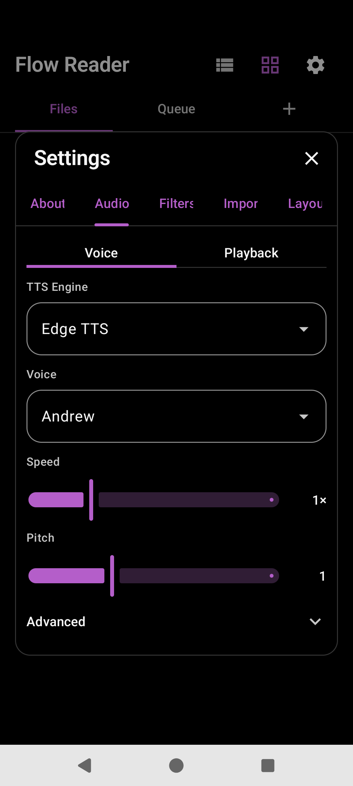

# TTS

Listen while reading. Engines and voices live under Settings → **Audio**; the reader media card and gestures control playback.

## Engines

- **Edge TTS** — Neural voices (default `en-US-AndrewNeural`), clip prefetch and size controls.
  Every Edge voice is offered (about 320 in 140 locales), picked by Language then Voice. The list comes
  from Edge's `voices/list` endpoint, cached in `filesDir/edge_voices.json` and refreshed at most
  weekly; before the first download the bundled snapshot `resources/tts/edge_voices.json` is used
  (`EdgeVoiceCatalog`, `EdgeVoiceStore`). SSML `xml:lang` follows the voice's locale. Sentence
  splitting is tuned for English, so clip boundaries in other languages can be rougher.
- **System Default** / other installed engines — Android TTS

Priority goals: stability → latency → footprint.

## Playback behavior

| Feature | Notes |
|---------|--------|
| Sentence highlight | Always |
| Word highlight | When engine provides boundaries |
| Auto-scroll | Follows playhead when enabled |
| Scroll lock | Forces follow; double-tap to unlock |
| Pin card | When playhead leaves the viewport |
| Margin rail | Cache / loading indicators for Edge clips |
| Media session | Notification + background keep-alive via `TtsPlaybackService` |
| Tonal underlay | Quiet noise while playing; optional standby until a paired A2DP device connects |
| Auto Play on Share | Off by default. Text, file and web-page shares (`LibraryViewModel.executeShareIntent`) open the saved book in the reader and call `play()` once it loads (`FlowApp.pendingSharePlay`), only when nothing is playing unless **Interrupt Playback** is on. Plugin links, clipboard paste and "Open with" are unchanged |

## Chapters and documents

- Entering a chapter loads the chapters on either side (local files and plugin streams alike), so
  crossing a chapter boundary doesn't wait on a load. Empty chapters are skipped; a load error
  ends playback and is logged (`pullMore failed`).
- Plugin chapters fetched by the reader window, TTS and cache upkeep share one fetch per chapter.
  Each spoken chapter change also downloads the story's cache level of chapters ahead (see
  [plugins.md](plugins.md)).

## Queue stream

The Queue is read as one document: every row in Queue order (done ones too) joined into one
composite book (`QueueBook`, session id `queue`, built by `QueueStreams`). Scrolling and TTS run
from one item into the next with no break, with the reader open or closed. When playback moves on
from item N to item N+1, `QueuePlayback` marks N done; the end of the stream marks the last item
done. `QueuePlayback` also watches `que_items`: rows appended at the end and Done changes are
swapped into the open session (TTS keeps playing and reads on into new rows); reordered or removed
rows rebuild the session at the spoken text and re-attach TTS (the current sentence restarts once).
Positions are still stored per item (the locator maps the stream position back to the item's own
chapter, block and progress fraction), so the Queue tab keeps its progress bars.

Known limits: TTS-only Local filters come from the item the stream was opened on; the first open
of an item in the stream synthesizes fresh clips (cache key is the stream, not the book).

## Unspeakable sentences

- Text with no letters or digits after TTS-only filters (scene breaks like `* * *`, lone
  punctuation, text a filter emptied) is skipped silently; with debug on, the log gets a
  `skip i=… nothing to say` line.
- Edge rejecting a sentence (`EdgeContentException`: nothing to synthesize, too long, no audio
  returned) skips it and keeps playing: debug turns on, the log records
  `ERROR skipped i=…: <reason> text="…" spoken="…"`, and the log panel opens.
- Network failures pause on the current sentence instead of stopping (see below). Other failures
  still stop playback (logged as `ERROR`).
- A failed lookahead clip isn't retried by prefetch; the playhead retries or skips it when it gets
  there. Characters XML forbids (control chars, lone surrogates) are stripped before Edge SSML.

## Edge requests and networks

- **Staggered race** (`EdgeTtsClient`, `RaceSchedule`): one WebSocket per clip at t = 0. Backups
  start at +d and +2d only while no attempt has received audio; an attempt that errors starts the
  next one at once. First success wins, the rest are cancelled; 6 s wall (`RACE_TIMEOUT_MS`).
- **Backup delay d** (`NetworkLanePolicy.hedgeDelayMs`): 90th percentile of the last 20 winners'
  first-audio latency, clamped 1–3 s; 2 s until 5 samples exist. Phones measured 1.0–2.7 s to first
  audio (desktop ~0.4 s), so a fixed 1 s sent a backup on every clip. A healthy link costs about one
  request per clip.
- **Stall**: the race failed, or a delayed backup had to win. A slow first attempt that still wins
  is not a stall.
- **Lanes** (`EdgeNetwork` = `NetworkMonitor` + `NetworkLanePolicy`): each attempt is sent on the
  default network, Wi-Fi, or cellular (OkHttp client bound to that `Network`). Modes:

| Mode | When | Attempts (start → network) |
|------|------|----------------------------|
| Normal | Signal fine, no recent stalls | 0, d, 2d → default |
| Overlap | Wi-Fi RSSI below −75 dBm (until above −68), or weak cellular (level ≤ 1) with Wi-Fi up | 0 Wi-Fi + 0 cellular, d cellular |
| Cell first | 2 stalls in a row on Wi-Fi, or Wi-Fi without internet | 0 cellular, d Wi-Fi, 2d cellular; every 4th race overlaps to probe Wi-Fi; 3 Wi-Fi wins → back |
| Offline | No usable network | No sends; playback waits |

- Cellular is requested (`requestNetwork`) once Wi-Fi drops below −70 dBm, stalls, or loses
  internet, and released 30 s after Wi-Fi recovers, or on pause/stop.
- Setting **Use mobile data when Wi-Fi is weak** (Playback tab, default On). Off: only Normal and
  Offline; cellular is never requested.
- **Network failure at the playhead** (`EdgeNetworkException`): logged as `ERROR network …`,
  playback waits without a time limit until a network is usable, backs off 1/2/4/8 s, clears failed
  lookahead, and retries the same sentence. Session and media card stay up; debug is not forced on.
- Synth log (5,000-line ring, ~20+ min): `edge race[pre i=N] start … plan=default@0,…` (source
  `pre` = lookahead, `play` = playhead, `next` = crossfade next clip, `regen`, `preview`),
  `edge race[pre i=N #k] start lane=… t=…`, `first-audio ms=…`, `win … firstAudioMs=… totalMs=…`,
  and `net poll|race mode=… rssi=… cellLevel=…` when the mode, cellular level, or RSSI (±3 dBm)
  changes. RSSI thresholds are starting values; tune from walk-test logs.

## Debug

About → Debug mode shows a synth dump FAB for Edge logs.

## Source

- [`tts/`](../app/src/main/java/com/personal/flowreader/tts/)
- [`TtsPlaybackService.kt`](../app/src/main/java/com/personal/flowreader/tts/TtsPlaybackService.kt)
- [`EdgeTtsClient.kt`](../app/src/main/java/com/personal/flowreader/tts/EdgeTtsClient.kt)
- [`AudioSettings.kt`](../app/src/main/java/com/personal/flowreader/ui/settings/AudioSettings.kt)

[Back to hub](README.md)
